# Andy's Smart Tool Swapper

**Not just the right tool — the right tool for the drop you want.**

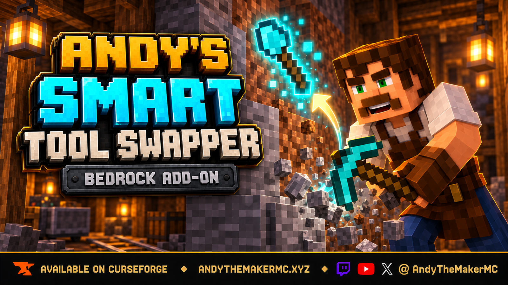

Intelligent automatic tool switching for Minecraft Bedrock. Start breaking a block and the tool that suits it comes to hand. Stop, and whatever you were holding comes straight back.

---

## What it does differently

Most automatic tool switchers answer one question: *what category of tool breaks this block?* This one answers a harder one: **of everything you are carrying, which exact tool should be in my hand for this exact block, given what I want out of it?**

| | A basic tool switcher | Smart Tool Swapper |
|---|---|---|
| Diamond ore | a pickaxe | your Fortune III pickaxe |
| A spawner | a pickaxe | your Silk Touch pickaxe |
| Dirt | a shovel | a shovel |
| A pickaxe about to break | equipped anyway | skipped |
| A 3×3 Hammer | equipped, eight blocks gone | left alone |
| Done mining | still holding the pickaxe | back to your torch |

### Fortune and Silk Touch are choices, not decoration

If you deliberately picked up a Silk Touch pickaxe, nothing here swaps you onto a Fortune one and hands you the wrong drop. That is the default. Switch to **Smart** and it goes the other way, choosing the enchantment each block deserves.

### It follows what you do, not where you look

No swapping based on whatever drifts across your crosshair. A swap begins when you start breaking something, and once you have started the tool keeps up as the material changes: stone → gravel → dirt → log → stone flows through the right tool for each, without releasing the button.

### It borrows, it does not take over

Whatever you were holding comes back when you stop. Place a run of blocks, notice one is wrong, break it, and your building stack is already back in your hand.

---

## Requirements

| | |
|---|---|
| Minecraft Bedrock | 1.26.30 or newer |
| Experiments | **None** |
| Cheats | Not required |
| Achievements | Fully compatible — verified in game |
| Graphics | Standard graphics and Vibrant Visuals |
| Dependencies | None |

---

## Installing

1. Download the `.mcaddon` from the [latest release](../../releases/latest).
2. Open it. Minecraft imports both packs.
3. Edit your world → **Behavior Packs** → activate **Andy's Smart Tool Swapper [BP]**. The Resource Pack follows automatically.

**Consoles** cannot import add-on files directly — join a Realm or server where it is already active, or apply it to a world from a phone, tablet or PC on the same account.

**Realms and dedicated servers**: upload the world with both packs active, or install both packs and list them in `world_behavior_packs.json` and `world_resource_packs.json`.

Nothing needs configuring first. Every option already sits on its recommended setting.

---

## Opening the menus

The add-on adds **no items and no blocks**. Both menus open from a plain stick renamed on an anvil. The name is what the add-on looks for, so it must match exactly, capital letters included.

### `SwapperControl` — your own settings

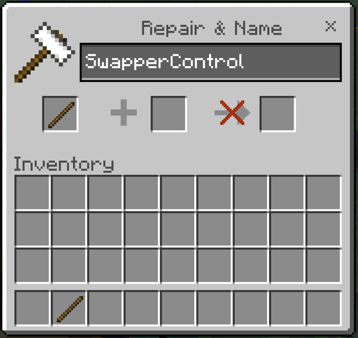

Anyone can make one. It opens your personal settings, the tool-marking page, and the "why did it pick that tool?" report.

### `AdminSwapperControl` — the world settings

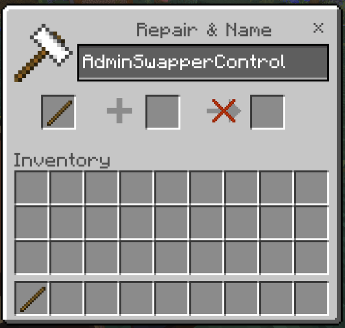

Operators only. For anyone else it politely refuses. It opens the world-wide settings and Teach Smart Tool Swapper.

**Hold sneak** at any time and the swapper pauses entirely. Release it and it resumes. No menu, no command.

---

## Your settings — every option explained

Open `SwapperControl`. Every setting here defaults to **World default**, meaning "whatever the world owner chose". Change one and it applies to you alone, so three players on one Realm can run the add-on three different ways.

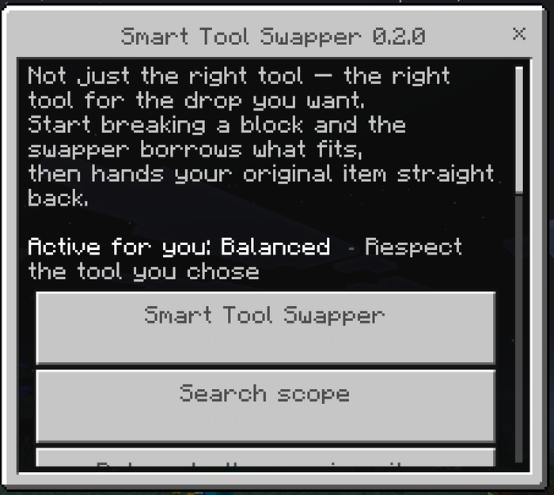

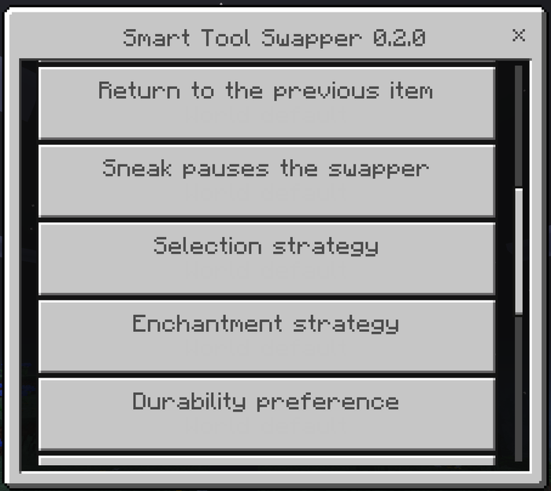

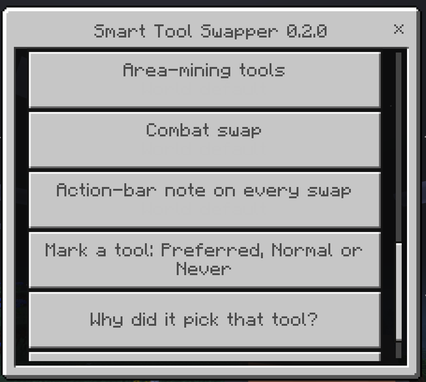

### Smart Tool Swapper — On / Off

Turns the whole thing off for you, leaving everyone else on the world unaffected. Useful when you want a session of pure vanilla mining without asking an operator for anything.

*You cannot switch it on if the world owner has switched it off.*

### Search scope — Hotbar only / Hotbar and inventory

**Hotbar only** (default) moves the selected-slot cursor and never touches your inventory. Fast, completely predictable, and nothing can ever end up in the wrong slot.

**Hotbar and inventory** also reaches tools sitting in rows 2 and 3. It swaps the tool you need into your hand, your held item out to where it came from, and puts the layout back when the action ends.

*When to change it:* use whole-inventory if you carry spare tools in storage rows and hate reorganising mid-session. Stay on hotbar-only if you are particular about your hotbar and would rather nothing ever moved. If you rearrange your inventory *during* a swing, the restore is deliberately skipped rather than risk shuffling slots you have since changed.

### Return to the previous item — On / Off

**On** (default): the add-on borrows. Break the block, get your torch back.
**Off**: the add-on takes. The borrowed tool stays in hand when you stop.

*When to change it:* almost nobody wants this off. It exists for players who genuinely prefer to keep whatever they last mined with.

### Sneak pauses the swapper — On / Off

**On** (default): holding sneak stops the swapper entirely, and releasing it resumes. It is the fastest possible manual override and needs no menu.

*When to change it:* switch it off only if you sneak constantly while mining and find the pause disruptive.

### Selection strategy — four ways to define "best"

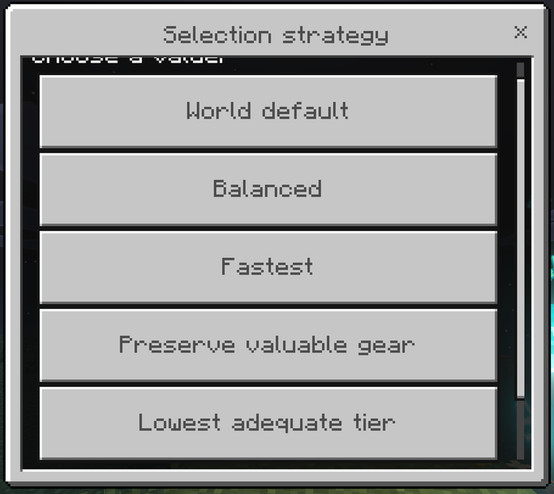

You own a stone pickaxe and an Efficiency V Netherite pickaxe, and you are mining ordinary stone.

| Strategy | What you get | When to use it |
|---|---|---|
| **Balanced** (default) | The Netherite, but it leans away from expensive gear when a fair alternative exists | General play. Suits most people |
| **Fastest** | The Netherite, every time | Strip mining, when speed is the only thing that matters |
| **Preserve valuable gear** | The stone pickaxe — the good one is saved for something that needs it | If you hate spending an enchanted pickaxe on cobblestone |
| **Lowest adequate tier** | The stone pickaxe, always. The cheapest tool that can *legally harvest* the block | Very frugal play. Never hands you something that cannot break the block |

Efficiency is read with the real formula, so an Efficiency V iron pickaxe genuinely outranks a bare Netherite one under Fastest — because it genuinely is faster.

Under **Preserve valuable gear**, enchantments and anvil names count heavily. A named, enchanted tool is treated as far more precious than raw materials alone would suggest.

### Enchantment strategy — what should the block drop?

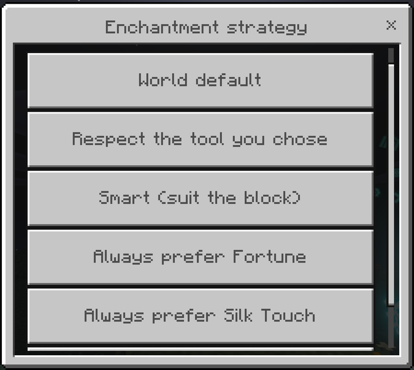

| Strategy | What it does | When to use it |
|---|---|---|
| **Respect the tool you chose** (default) | If you are holding a Fortune or Silk Touch tool that can do the job, nothing swaps it out | Always safe. Best if you switch enchantments by hand a lot |
| **Smart** | Picks the enchantment each block deserves | Set-and-forget mining where you want the best drop without thinking |
| **Always Fortune** | Prefers a Fortune tool on every block | Dedicated ore runs |
| **Always Silk Touch** | Prefers a Silk Touch tool on every block | Harvesting blocks to rebuild with |

**Smart** knows what each block is worth:

| Block group | Wants |
|---|---|
| Ores, gravel, glowstone, sea lanterns, melons, mushroom blocks, amethyst clusters | Fortune |
| Glass, ice, grass blocks, mycelium, podzol, sculk, budding amethyst, turtle eggs, bookshelves, leaves, snow | Silk Touch |
| Spawners, trial spawners, vaults, end portal frames | Silk Touch |
| Everything else | No preference — whatever is fastest |

### Durability preference — which of two working tools?

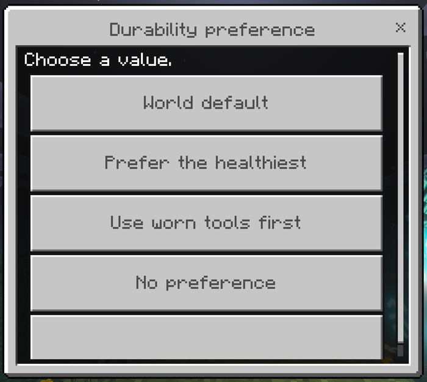

| Option | What it does | When to use it |
|---|---|---|
| **Prefer the healthiest** (default) | Spreads wear evenly across your spares | General play |
| **Use worn tools first** | Finishes off a tool you want used up, repaired, or gone | Clearing out a chest of half-dead pickaxes |
| **No preference** | Ignores condition entirely | If you only ever carry one of each |

Separately from this, the world's **low-durability avoidance** skips tools close to breaking so nothing you are handed dies mid-swing. That is a world setting, described below.

### Area-mining tools — Never / May be selected / Prefer

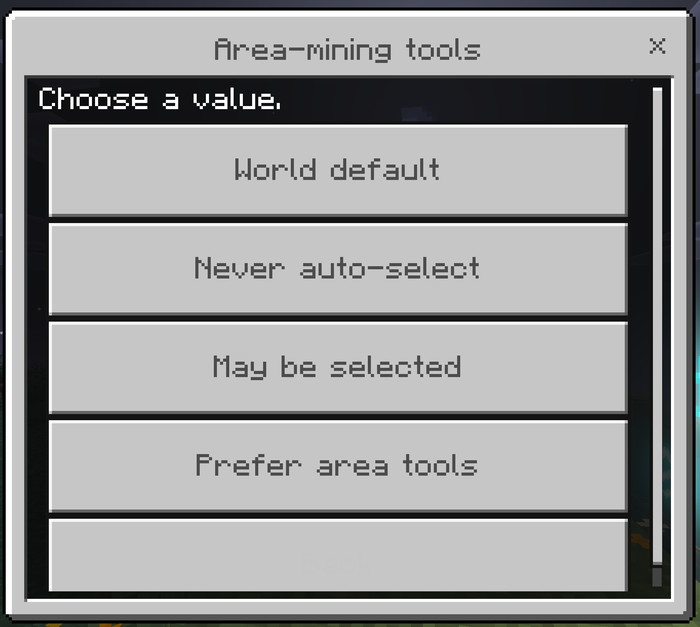

A 3×3 Hammer is technically a pickaxe. Equipping one to fix a single misplaced block takes eight of its neighbours with it.

| Option | What it does |
|---|---|
| **Never auto-select** (default) | Area tools are never chosen for you. You can still use one by selecting it yourself |
| **May be selected** | Area tools compete normally with everything else |
| **Prefer area tools** | Area tools win whenever one fits |

Hammers, Excavators, Tillers, Sickles, Scythes, Seeder Rakes and Pavers are recognised automatically. Anything else can be registered by hand.

### Combat swap — Off / Your preferred weapon / Best melee weapon

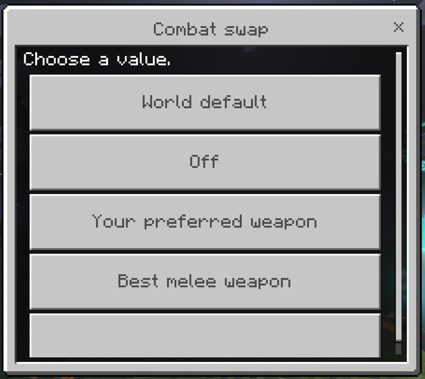

| Option | What it does |
|---|---|
| **Off** (default) | Weapons are never touched |
| **Your preferred weapon** | Selects only a weapon you have explicitly marked **Preferred**. Does nothing until you mark one |
| **Best melee weapon** | Scores damage and Sharpness and takes the best |

**Combat Lock** works whether or not combat swap is on: once a fight starts, the wall behind a zombie drifting into your crosshair will not put a pickaxe in your hand mid-swing.

### Action-bar note on every swap — On / Off

Prints the chosen tool and the reason it won just above your hotbar, and says what you were returned to when the action ends.

*When to use it:* switch it on while you are tuning your strategy — it shows you exactly what the engine is thinking. Most people turn it off after the first hour.

### Mark a tool: Preferred, Normal or Never

The mark follows that **exact item**, not its type. One of two identical Netherite pickaxes can be permanently off limits while the other stays in the rotation.

| Mark | What it does |
|---|---|
| **Preferred** | Favoured whenever it is a valid candidate, outranking even a faster tool |
| **Normal** | Ordinary selection |
| **Never auto-select** | Never chosen automatically, for any block |

Put the tool in your hotbar, open `SwapperControl` → **Mark a tool**, and pick it from the list. The list shows each tool's current mark, so you can see what is set before changing anything.

*When to use it:* a named collector's piece, a specific enchantment combination you are saving, a tool reserved for one job, or simply the pickaxe you do not want anything touching.

### Why did it pick that tool?

Runs the real engine against the block you are aiming at and reads back every candidate it considered, in score order, with the reason each one won or lost — including the ones it skipped and why.

If the add-on ever surprises you, this is the answer, and it is the first thing to include in a bug report.

---

## World settings — for the world owner

Open `AdminSwapperControl` as an operator. Everything above has a world-wide version here, plus the settings only an operator can reach.

Six pages: **Core Behavior**, **Selection & Enchantments**, **Durability**, **Tool Classes & Area Tools**, **Combat**, and **Players & Notifications**.

### Core Behavior

| Setting | Options | Default | What it does |
|---|---|---|---|
| Smart Tool Swapper | On / Off | On | The master switch for the world |
| Search scope | Hotbar / Hotbar and inventory | Hotbar | The default search scope for everyone |
| Return to the previous item | On / Off | On | Whether the add-on borrows or takes |
| Sneak pauses the swapper | On / Off | On | Whether sneak is a pause |
| **Builder protection** | On / Off | On | Keeps the swapper out of the way while a player is actively placing blocks. It never blocks the useful case — start breaking a misplaced block and the right tool still comes to hand, then your building stack comes back |

### Selection & Enchantments

The world-wide default for **Selection strategy** and **Enchantment strategy**, with the same four options each as described above.

*Server tip:* a survival server that wants gear to last sets Preserve valuable gear here; a mining server sets Fastest and Smart.

### Durability

| Setting | Options | Default | What it does |
|---|---|---|---|
| **Low-durability avoidance** | Off / Skip tools near breaking | Skip | Whether tools close to breaking are eligible at all |
| **Durability preference** | Healthiest / Worn first / No preference | Healthiest | Which of two safe tools wins |
| **Points held back as unsafe** | 1–64 | 3 | How close to breaking is too close. Raise it if players keep losing tools mid-swing |
| **Respect Durability Guard** | On / Off | On | Reads Andy's Advanced Durability Guard's reserve, when that add-on is installed, and raises the floor to match |

A tool inside the Durability Guard's reserve still looks perfectly healthy to anything reading only its damage value — but equipping one produces a swing that does nothing. That is why this is on by default.

### Tool Classes & Area Tools

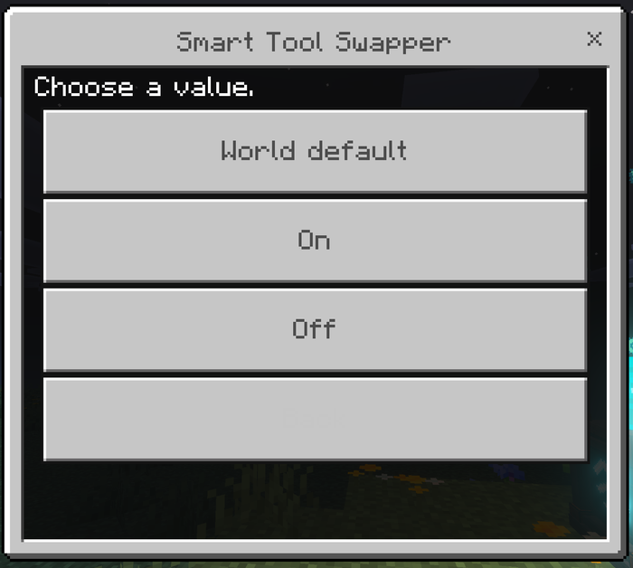

| Setting | Options | Default |
|---|---|---|
| Area-mining tools | Never / May be selected / Prefer | Never |
| Swap to pickaxes | On / Off | On |
| Swap to axes | On / Off | On |
| Swap to shovels | On / Off | On |
| Swap to hoes | On / Off | On |
| Swap to shears | On / Off | On |

Switching a class off means the engine will never equip one. Useful if, for example, you never want players' shears touched.

### Combat

| Setting | Options | Default | What it does |
|---|---|---|---|
| Combat swap | Off / Preferred / Best | Off | The world-wide weapon policy |
| **Combat Lock** | On / Off | On | Holds the weapon during a fight so mining swaps cannot interrupt it |
| **Combat Lock window** | 1–30 seconds | 5 | How long after the last hit the lock holds. Raise it for slower, more deliberate combat |

### Players & Notifications

| Setting | Options | Default | What it does |
|---|---|---|---|
| Action-bar note on every swap | On / Off | Off | The world-wide default for the swap notice |
| **Players may change their own settings** | On / Off | On | Switch it off to lock everyone to the server configuration. `SwapperControl` then tells players their settings are locked |
| **One-time welcome tip** | On / Off | On | The single chat message a new player gets explaining the renamed stick |

### Teach Smart Tool Swapper

Tools that declare the ordinary item tags — `minecraft:is_pickaxe`, `is_axe`, `is_shovel`, `is_hoe`, `is_sword`, `digger` — are recognised with no setup at all.

For anything else, put the tool in your hotbar and use `AdminSwapperControl` → **Teach Smart Tool Swapper** → **Register a tool from my hotbar**. Pick it, choose its class, and say whether it breaks an area. The registration applies to that item type for the whole world.

A taught classification outranks both the item's tags and its name, so it is also how you correct a wrong guess.

### Clear the operator override

Drops every operator change and hands the world back to the gear-menu settings chosen at world creation. Player marks and registered custom tools are unaffected.

---

## Dedicated servers

The gear icon lives on the *client's* world-settings screen, which a hosted server never opens. Everything is therefore reachable from the console:

```
scriptevent andy_sts:help
scriptevent andy_sts:status
scriptevent andy_sts:on
scriptevent andy_sts:off

scriptevent andy_sts:set <setting> <value>
scriptevent andy_sts:get <setting>
scriptevent andy_sts:list [core|selection|durability|tools|combat|players]

scriptevent andy_sts:player <name> <setting> <value|inherit>
scriptevent andy_sts:player_get <name>
scriptevent andy_sts:player_reset <name>

scriptevent andy_sts:teach <item id> <class> [area]
scriptevent andy_sts:forget <item id|all>
scriptevent andy_sts:tools

scriptevent andy_sts:debug <player name>
scriptevent andy_sts:reset
```

Setting names are the aliases shown by `andy_sts:list` — for example `search_scope`, `enchant_strategy`, `durability_floor`, `area_tools`, `combat_lock_seconds`, `allow_player_config`.

Console commands are authorized by the **event source**, not by a player's permission rank, so the server console is never refused for the lack of a player behind it.

**Precedence:** the gear-menu toggles are the base. Anything an operator or the console sets is written into a persistent override that wins **for that one setting only** — changing the search scope does not silently reset everything else. `scriptevent andy_sts:reset` drops the override entirely.

### Worked examples

```
# Survival server: make gear last, never touch deep storage
scriptevent andy_sts:set strategy preserve_gear
scriptevent andy_sts:set search_scope hotbar

# Mining server: speed, and the best drop for each block
scriptevent andy_sts:set strategy fastest
scriptevent andy_sts:set enchant_strategy smart
scriptevent andy_sts:set search_scope inventory

# Lock everyone to the server configuration
scriptevent andy_sts:set allow_player_config off

# Make a modpack's custom tools work
scriptevent andy_sts:teach mypack:ruby_pickaxe pickaxe
scriptevent andy_sts:teach mypack:ruby_hammer pickaxe area
scriptevent andy_sts:tools
```

---

## Works with

Each of these is optional, and every add-on works completely on its own.

| Add-on | What happens |
|---|---|
| **Andy's Advanced Durability Guard** | A tool inside the Guard's reserve is never selected — equipping one produces a swing that does nothing |
| **Andy's Advanced Hammers, Excavators & More** | Hammers, Excavators, Tillers, Sickles and Seeder Rakes are recognised as area tools and held back by default |
| **Andy's Silk Touch Relics** | Spawners, vaults, budding amethyst and end portal frames ask for Silk Touch |
| **Andy's Configurable Vein Miner & Tree Capacitor** | The swap lands before the block breaks, so the intended tool is already active |
| **Andy's Handy Hotbar Reloader** | Complementary — refilling stacks belongs there |

Do not run two automatic tool switchers in one world; both will fight for the selected slot.

---

## What it deliberately does not do

No auto-totem, no auto-armor, no Elytra deployment, no stack refill, no inventory sorting, no general survival automation. It is a tool-selection engine and it stays one.

---

## Troubleshooting

**Nothing swaps at all.** Are you sneaking? That pauses it by design. Then check `SwapperControl` — if your personal setting is Off, that is the answer. On a server, `scriptevent andy_sts:status` reports which configuration is in force.

**It picked a tool I did not expect.** `SwapperControl` → **Why did it pick that tool?** while aiming at the block. It lists every candidate with its reason. Nine times out of ten the answer is the selection strategy or the durability floor doing exactly what it was set to.

**It will not use my best pickaxe.** Either it is marked Never auto-select, or the strategy is Preserve valuable gear / Lowest adequate tier, or it is close enough to breaking that the safety floor is skipping it. The diagnostic names which.

**My hammer is not being equipped.** Deliberate. Set **Area-mining tools** to *May be selected* or *Prefer*.

**A custom tool is ignored.** It does not declare the standard item tags. Register it under Teach Smart Tool Swapper.

**The stick does nothing.** Check the name is spelled exactly right, including its capital letters, and that it is a plain vanilla stick.

---

## Reporting problems

Please include your Bedrock version and platform, the add-on version, whether you are in single-player or on a server, what you were breaking and what you were holding, the output of **Why did it pick that tool?**, and any other add-ons active — especially another tool switcher.

---

## Keep Exploring with Andy

If Andy's Smart Tool Swapper saves you a hotbar fumble every few seconds—or simply hands you the right drop for once—come explore what else Andy is building. Visit [AndyTheMakerMC.xyz](https://andythemakermc.xyz/) for more Minecraft Bedrock add-ons, `.mcstructure` downloads, HoloPrint files, world lore, tutorials, guides, videos, and other creations.

## Join the AndyTheMakerMC Community

Follow **@AndyTheMakerMC** for new add-on releases, development updates, tutorials, showcases, streams, and more Minecraft adventures:

- [YouTube](https://www.youtube.com/@AndyTheMakerMC)
- [Twitch](https://twitch.tv/AndyTheMakerMC)
- [X](https://x.com/AndyTheMakerMC)
- [TikTok](https://www.tiktok.com/@AndyTheMakerMC)
- [Instagram](https://www.instagram.com/AndyTheMakerMC)

## Help Bring More Add-ons to Life

Enjoying the add-on? Ratings, favorites, recommendations, and kind comments all help more Bedrock players discover Andy's work. If you would also like to support future add-ons, guides, videos, and other AndyTheMakerMC projects, you can contribute through [Ko-fi](https://ko-fi.com/andythemaker) or make a [direct Stripe contribution](https://buy.stripe.com/4gM4gz0qu0xwgxw0IfcMM00). Every bit of support is appreciated, but it is never required.

## End-user permission

You may download the official, unmodified release of Andy's Smart Tool Swapper from its official CurseForge or authorized GitHub project page and install, activate, and use it in personal single-player worlds, multiplayer worlds, Realms, and compatible Bedrock servers.

This permission includes Minecraft's normal automatic delivery of the official, unmodified add-on to players joining a world, Realm, or server where it is active. It does not permit offering the add-on file separately or distributing it as part of a world download, modpack, bundle, mirror, archive, or server download.

## Content-creator permission

Content creators may use an official, unmodified release of Andy's Smart Tool Swapper in original gameplay videos, livestreams, screenshots, tutorials, reviews, showcases, articles, guides, social posts, and other original content, including monetized content.

Credit to **AndyTheMakerMC** and a link to the official CurseForge project page are appreciated whenever practical. This permission covers display of normal gameplay and commentary; it does not grant permission to redistribute, modify, extract, or republish the add-on or its assets.

## License — All Rights Reserved

**All Rights Reserved. Copyright © 2026 Andy / AndyTheMakerMC.**

You may not redistribute, reupload, rehost, mirror, resell, sublicense, bundle, repackage, modify and publish, translate, adapt, decompile, disassemble, reverse engineer, extract, or reuse the add-on, its source code, scripts, documentation, branding, textures, models, pack icons, or promotional artwork without prior written permission from the copyright holder.

You may not create derivative works or incorporate any portion of the project into another add-on, Behavior Pack, Resource Pack, application, product, modpack, download, or project without prior written permission. The end-user and content-creator permissions above are limited permissions; they do not transfer ownership or grant redistribution rights.

The promotional artwork is original AI-assisted concept artwork directed for this project. It is not an in-game screenshot.

Minecraft is a trademark of Microsoft Corporation. This project is not affiliated with, endorsed by, sponsored by, or associated with Microsoft or Mojang Studios.
